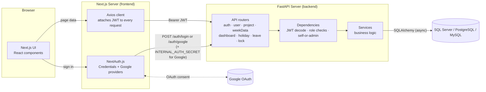

# Resource Management System

[](https://github.com/amulyavarshney/Resource-Management-System/stargazers)
[](https://github.com/amulyavarshney/Resource-Management-System/fork)
[](LICENSE)
[](https://github.com/amulyavarshney/Resource-Management-System/issues)
[](#contributing)

A full-stack web application for tracking project progress and managing employee resources. It covers timesheet entry, leave and holiday management, interactive dashboards, and admin controls — all secured behind JWT-based authentication, with role-based access and Google sign-in built in.

If this project is useful to you, **star it** ⭐ — it helps others find it and lets you know when new features land. Found a rough edge? **Fork it**, fix it, and open a pull request; see [Contributing](#contributing) below.

## Repository Structure

```
Resource-Management-System/
├── backend/    # FastAPI (Python 3.11) Web API      → backend/README.md
└── frontend/   # Next.js 14 application              → frontend/README.md
```

Setup steps, environment variables, the full API reference, and the demo
accounts live in each project's own README, linked throughout this file —
this README stays focused on the big picture.

## Architecture



Both servers run independently — the frontend never talks to the database
directly, and the backend never talks to Google directly. The Next.js
server is the only thing trusted to hold `INTERNAL_AUTH_SECRET`, so Google
identities are always verified server-side before being exchanged for an
app JWT.

For the request/response and login-sequence diagrams, see
[backend/README.md](backend/README.md#authentication-flow); for the
role/permission model and data model, see
[backend/README.md](backend/README.md#data-model) and
[backend/README.md](backend/README.md#roles--permissions); for the
frontend's page map, see [frontend/README.md](frontend/README.md#pages).

## Tech Stack

| Layer | Technology |
|-------|-----------|
| Backend | Python 3.11, FastAPI, SQLAlchemy 2 (async), Alembic |
| Database | SQL Server / PostgreSQL / MySQL |
| Frontend | Next.js 14 (App Router), React 18, TypeScript 5 |
| Styling | Tailwind CSS 3 |
| Auth | JWT Bearer (backend) · NextAuth.js 4 (frontend) |
| Containerisation | Docker |

Full dependency lists: [backend/README.md](backend/README.md#technology) ·
[frontend/README.md](frontend/README.md#technology).

## Features

- **Timesheet management** — employees log hours per project per week; timesheets can be locked by period
- **Leave management** — apply for, view, and delete leave records with type and session (full/half day)
- **Holiday management** — company-wide and personal holiday overrides by region
- **Interactive dashboards** — project and user analytics with FTE / external breakdowns
- **Admin panel** — full CRUD for users, projects and holidays; bulk import from Excel; lock/unlock timesheets; consolidated reporting
- **User profiles** — update personal details, change or remove password
- **Role-based access** — Employee · Management · Executive · Admin · Developer
- **Google sign-in** — alongside email/password, via NextAuth

## Getting Started

1. **Backend** — follow [backend/README.md § Setup](backend/README.md#setup)
   to get the API running at `http://localhost:8000`.
2. **Frontend** — follow [frontend/README.md § Setup](frontend/README.md#setup)
   to get the UI running at `http://localhost:3000`.
3. **Try it out** — seed demo accounts and smoke-test the API with
   [backend/README.md § Demo accounts](backend/README.md#demo-accounts-localdev-only).

## Docker

The backend ships with a `Dockerfile` and `docker-compose.yml` — see
[backend/README.md § Docker](backend/README.md#docker) for both the
standalone-container and compose forms and their required variables.

## Contributing

Contributions are very welcome, whether that's a bug fix, a new feature, or
just improving the docs.

1. [Fork the repository](https://github.com/amulyavarshney/Resource-Management-System/fork).
2. Create a branch: `git checkout -b feature/your-feature`.
3. Make your changes — run the backend/frontend tests documented in their
   own READMEs as you go.
4. Commit your changes with a clear message.
5. Push and [open a pull request](https://github.com/amulyavarshney/Resource-Management-System/pulls) against `main`.

Not sure where to start? Check [open issues](https://github.com/amulyavarshney/Resource-Management-System/issues)
for ideas, or open a new one to discuss what you have in mind.

## License

MIT License. See [`LICENSE`](LICENSE) for details.
