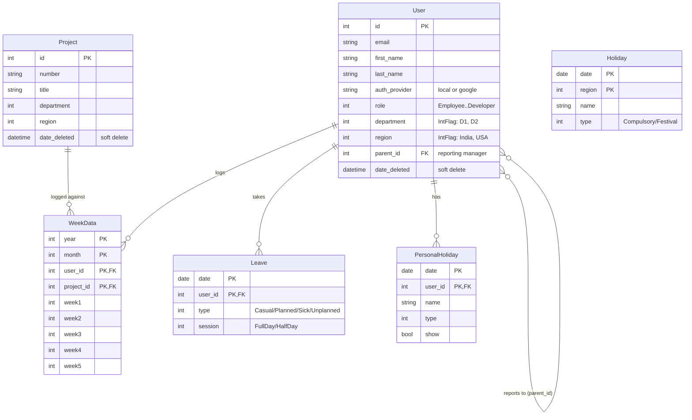
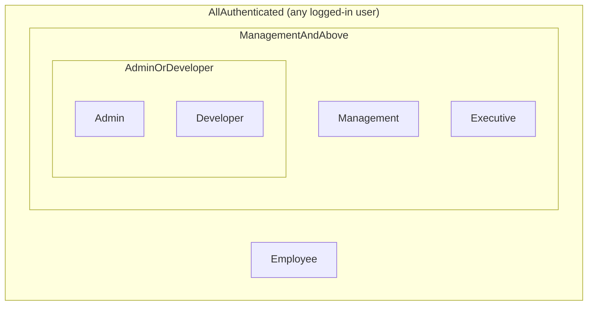
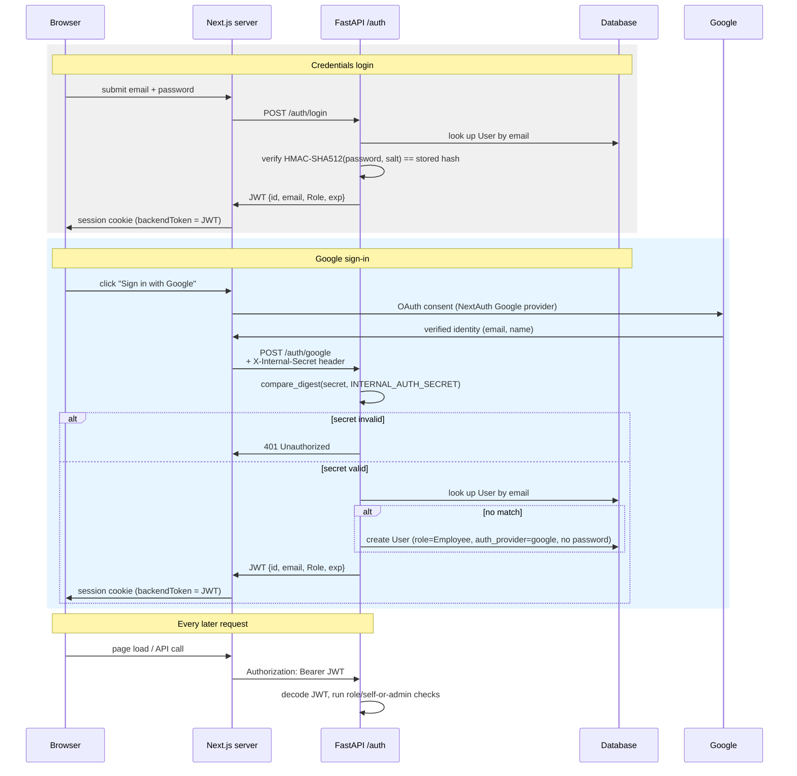

# Backend — Python / FastAPI

The Resource Management System API — a Python 3.11 + FastAPI service covering auth, users, projects, timesheets, dashboards, holidays, leaves, and timesheet locking.

## Technology

| Component | Package | Version |
|-----------|---------|---------|
| Framework | FastAPI | ≥ 0.115 |
| ASGI server | Uvicorn | ≥ 0.30 |
| ORM | SQLAlchemy (async) | ≥ 2.0 |
| Migrations | Alembic | ≥ 1.13 |
| Validation | Pydantic v2 | ≥ 2.7 |
| Auth | python-jose + passlib | ≥ 3.3 / 1.7 |
| Excel | openpyxl | ≥ 3.1 |
| Logging | structlog | ≥ 24.1 |
| Tests | pytest-asyncio + httpx | ≥ 0.23 / 0.27 |

## Project Structure

```
backend/
├── app/
│   ├── api/v1/routers/     # FastAPI routers (one per resource)
│   ├── core/               # Config, security (JWT + bcrypt), deps, exceptions, logging
│   ├── db/                 # SQLAlchemy engine, session, Base
│   ├── models/             # SQLAlchemy ORM models + enums
│   ├── schemas/            # Pydantic request/response models
│   ├── services/           # Business logic (one class per domain)
│   ├── utils/              # Date helpers, enum utils, Excel reader, mapper
│   └── main.py             # FastAPI app, middleware, exception handlers
├── alembic/                # Database migrations
├── tests/                  # pytest suite
├── Dockerfile
├── docker-compose.yml
├── pyproject.toml
└── .env.example
```

## Data Model



Composite primary keys (e.g. `WeekData` on `year + month + user_id +
project_id`) avoid a separate surrogate key for what's naturally a join
row. Nothing is ever hard-deleted — every entity with a `date_deleted`
column is filtered out of normal queries rather than removed, so historical
timesheets/projects/users stay intact even after "deletion."

## Setup

### Prerequisites

- Python 3.11+
- SQL Server (or PostgreSQL/MySQL — see `DATABASE_URL` in `.env.example`)
- ODBC Driver 18 for SQL Server (if using SQL Server)

### Local development

```sh
# 1. Create and activate a virtual environment
python -m venv .venv
source .venv/bin/activate          # Windows: .venv\Scripts\activate

# 2. Install dependencies
pip install -e ".[dev]"

# 3. Configure environment
cp .env.example .env
# Edit .env — set DATABASE_URL, JWT_SECRET, ALLOWED_ORIGINS

# 4. Apply database migrations
alembic upgrade head

# 5. Start the server
uvicorn app.main:app --reload
# API:     http://localhost:8000
# Swagger: http://localhost:8000/swagger
```

### Docker

```sh
cp .env.example .env   # fill in JWT_SECRET at minimum
docker compose up --build
# API:     http://localhost:8000
# Swagger: http://localhost:8000/swagger (development mode only)
```

## Environment Variables

| Variable | Required | Default | Description |
|----------|----------|---------|-------------|
| `DATABASE_URL` | Yes | — | SQLAlchemy async URL (see `.env.example`) |
| `JWT_SECRET` | Yes | — | HS512 signing key, min 32 chars |
| `JWT_ALGORITHM` | No | `HS512` | JWT signing algorithm |
| `JWT_EXPIRE_HOURS` | No | `2` | Token lifetime in hours |
| `ALLOWED_ORIGINS` | No | localhost | Comma-separated CORS origins |
| `APP_ENV` | No | `development` | `development` enables Swagger UI |
| `LOG_LEVEL` | No | `info` | structlog level |

## Database Migrations

```sh
# Generate a new migration after model changes
alembic revision --autogenerate -m "describe change"

# Apply all pending migrations
alembic upgrade head

# Rollback one step
alembic downgrade -1
```

## Running Tests

```sh
pip install -e ".[dev]"
# Tests use an in-memory SQLite database — no server needed
pytest -v
```

## Roles & Permissions

Every role higher up the list also satisfies every check lower down —
`AdminOrDeveloper` is a strict superset of `ManagementAndAbove`, which is a
strict superset of `AllAuthenticated`. `SelfOrAdmin`/`SelfOnly` are
orthogonal to the role tiers: they compare the JWT's `id` claim against the
`{id}` path parameter regardless of role.



| Dependency (`app/core/deps.py`) | Allowed roles | Used on |
|---|---|---|
| `AllAuthenticated` | Employee, Management, Executive, Admin, Developer | Most reads (timesheets, dashboards, holidays, own profile) |
| `ManagementAndAbove` | Management, Executive, Admin, Developer | `POST /lock` (company-wide timesheet lock) |
| `AdminOrDeveloper` | Admin, Developer | `POST /user`, `*/import`, `*/reset`, `DELETE /user/{id}`, `DELETE /project/{id}` |
| `SelfOrAdmin` | Caller's own `id`, or Admin/Developer | `PATCH /user/{id}`, `PATCH /user/{id}/changePassword` |
| `SelfOnly` | Caller's own `id` only — no admin override | `PATCH /user/{id}/removePassword` |

`SelfOnly` has no admin override by design: nulling someone *else's*
password with no recovery path would be an unrecoverable lockout, so
removal is strictly self-service. `role` is never accepted from the
request body at account-creation time (self-registration, Google
sign-in) — it's always forced to `Employee` server-side; only an
already-authenticated Admin/Developer can set a different role via
`PATCH /user/{id}`.

## API Reference

All routes are prefixed `/api/v1/`. Protected routes require `Authorization: Bearer <token>`.
Some routes additionally require Admin/Developer (or Management+) — see above.

| Router | Prefix | Auth |
|--------|--------|------|
| Auth | `/auth` | Public |
| Users | `/user` | Required (some routes Admin/Developer, or self-only) |
| Projects | `/project` | Required (import/delete/reset: Admin/Developer) |
| WeekData | `/weekdata` | Required (reset: Admin/Developer) |
| Dashboard | `/dashboard` | Required |
| Holidays | `/holiday` | Required (import/reset: Admin/Developer) |
| Leaves | `/leave` | Required (reset: Admin/Developer) |
| Lock | `/lock` | Required (set lock: Management/Executive/Admin/Developer) |
| Health | `/health/live`, `/health/ready` | Public |

Full interactive docs at `/swagger` in development mode.

### Authentication flow

Both login paths converge on the same JWT shape (`id`, `email`, `Role`,
`exp`), so every downstream router treats a Credentials-issued and a
Google-issued token identically.



`INTERNAL_AUTH_SECRET` never reaches the browser — only the Next.js server
and FastAPI hold it, so the `/auth/google` exchange can't be called by
anything except the trusted frontend server. Role is always assigned
server-side (`Role.Employee` for new registrations and new Google
sign-ins); no request body can set an arbitrary role at account-creation
time.

## Demo accounts (local/dev only)

Self-registration always creates an `Employee`-role account — there is no
way to self-serve into a privileged role. To try out Management/Executive/
Admin/Developer features locally, seed a fixed set of demo accounts:

```sh
cd backend && python -m scripts.seed_demo
```

This creates one account per role (idempotent — safe to re-run) and prints
the shared demo password. The script refuses to run unless
`APP_ENV=development`, so it can never be run against a production database.

| Email | Role |
|-------|------|
| `demo.employee@rms.example` | Employee |
| `demo.manager@rms.example` | Management |
| `demo.executive@rms.example` | Executive |
| `demo.admin@rms.example` | Admin |
| `demo.developer@rms.example` | Developer |

Password for all of the above: `DemoPass1!`

## Design Notes

- **Password hashing** — `hmac.new(salt, password, sha512)` with a random salt per user.
- **Department/Region filters** — modeled as `IntFlag` enums, filtered via bitwise AND in SQLAlchemy (`.op("&")`).
- **Soft deletes** — a `date_deleted` column on each entity; queries filter it out rather than physically deleting rows.
- **Timesheet lock** — process-local in-memory store (`DashboardService`), keyed by department/region. Resets on restart; swap for Redis if you need it to survive restarts or run across multiple instances.
- **Excel import** — `openpyxl` reads `.xlsx` uploads for bulk user/project/holiday import.
