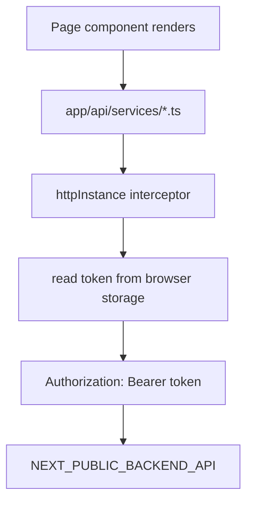
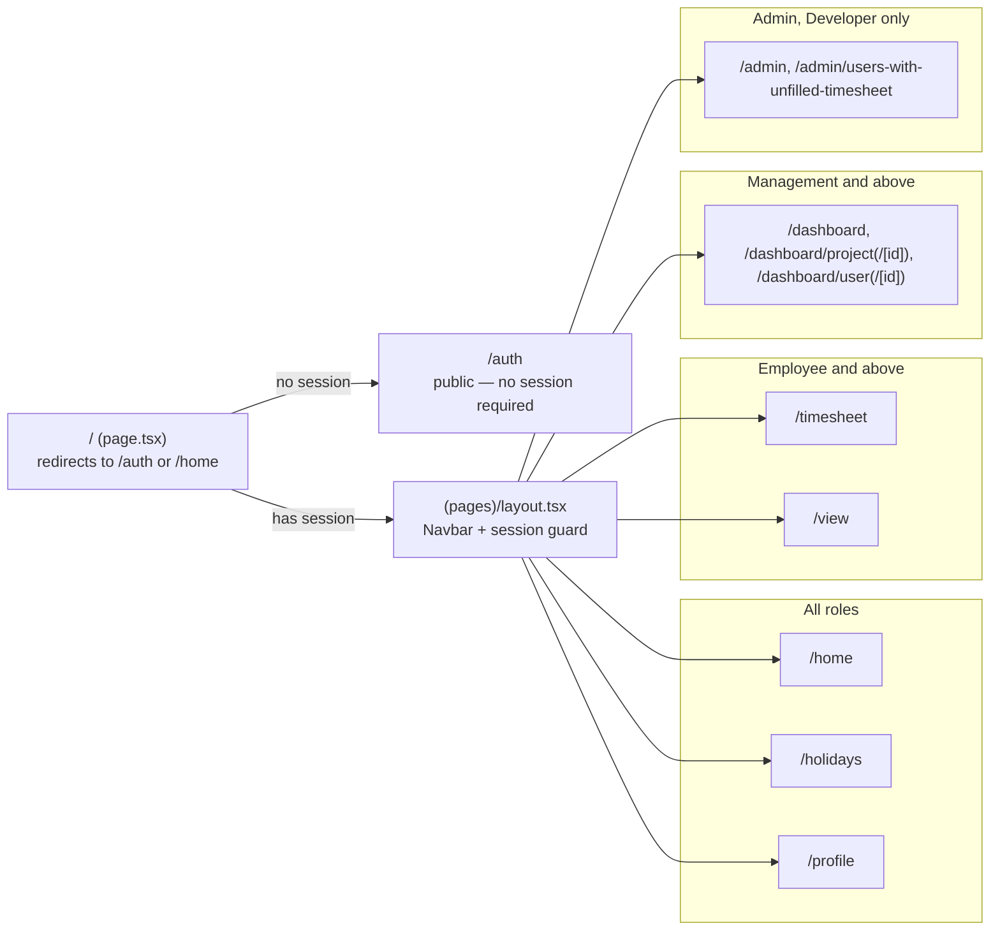

# Frontend — Resource Management System

Next.js 14 web application for the Resource Management System. Provides the complete UI: timesheet entry, dashboards, admin controls, leave/holiday management, and user profiles.

## Technology

| Package | Version |
|---------|---------|
| Next.js | 14.2 |
| React | 18.3 |
| TypeScript | 5.1 |
| Tailwind CSS | 3.3 |
| Client JWT auth | — |
| Axios | 1.4 |
| react-hot-toast | 2.4 |
| xlsx-js-style | 1.2 |

## Project Structure

```
frontend/
├── app/
│   ├── layout.tsx                   # Root layout — AuthProvider, Toaster
│   ├── page.tsx                     # Root redirect (→ /auth or /home)
│   ├── (pages)/                     # Protected route group
│   │   ├── layout.tsx               # Shared layout with Navbar + auth guard
│   │   ├── home/                    # Landing page
│   │   ├── timesheet/               # Timesheet entry
│   │   ├── view/                    # View past timesheets
│   │   ├── dashboard/               # Analytics dashboards
│   │   │   ├── project/detail/
│   │   │   └── user/detail/
│   │   ├── profile/                 # User profile and settings
│   │   ├── admin/                   # Admin panel
│   │   │   └── users-with-unfilled-timesheet/
│   │   └── holidays/                # Holiday list
│   ├── auth/                        # Public auth pages (login, register)
│   ├── api/
│   │   ├── services/                # Axios API clients
│   │   └── generated/               # OpenAPI TypeScript types
│   │   ├── services/                # Typed Axios API clients
│   │   └── generated/               # OpenAPI-generated types
│   ├── components/                  # Shared UI components
│   └── contexts/                    # React Context providers
├── e2e/                             # Playwright smoke tests
├── public/                          # Static assets (SVGs, images)
├── next.config.js                   # Next.js config + security headers
├── playwright.config.ts
├── tailwind.config.js
├── tsconfig.json
└── package.json
```

## Setup

### Prerequisites

- Node.js 18 LTS or later
- npm 9 or later
- A running instance of the backend API

### Install and run

```sh
npm install
npm run dev        # http://localhost:3000
```

### Build for production

```sh
npm run build
npm start
```

### Other scripts

```sh
npm run lint       # ESLint
npm run format     # Prettier
npm run test:e2e   # Playwright (API must be on :8000; builds/starts UI via config)
npm run generate:api  # Refresh OpenAPI JSON + TypeScript types from the FastAPI schema
```

Requires a running backend (`uvicorn app.main:app --port 8000`). CI starts both automatically.

Generated API types live in `app/api/generated/` (from `openapi.json`). After backend schema changes, activate the backend venv and run `npm run generate:api`.

### Docker

```sh
# From frontend/ — build args bake browser-facing NEXT_PUBLIC_* at image build time
docker build -t rms-frontend \
  --build-arg NEXT_PUBLIC_BACKEND_API=http://localhost:8000/api/v1 \
  --build-arg NEXT_PUBLIC_FRONTEND_URL=http://localhost:3000 \
  .

docker run --rm -p 3000:3000 rms-frontend
```

For API + DB + UI together, use the root `docker-compose.yml`.

## Environment Variables

Create `.env.local` for local overrides (not committed). The committed `.env.development` and `.env.production` files contain non-secret defaults.

| Variable | Required | Description |
|----------|----------|-------------|
| `NEXT_PUBLIC_FRONTEND_URL` | Yes | Public base URL of this app |
| `NEXT_PUBLIC_BACKEND_API` | Yes | Backend API base URL for the **browser** (e.g. `http://localhost:8000/api/v1`) |
| `NEXT_PUBLIC_ALLOW_SELF_REGISTRATION` | No | Set `false` to hide Register and match backend `ALLOW_SELF_REGISTRATION=false` |
| `NEXT_PUBLIC_CONTACT_SUPPORT` | No | Support link on Unauthorized pages (e.g. `mailto:…`); hidden when unset |
| `NEXT_PUBLIC_MAX_HOURS` | No | Default work hours per day (default `8`) |
| `NEXT_PUBLIC_FETCH_LOCK_INTERVAL` | No | Timesheet lock poll interval in ms (default `60000`) |

Mail is sent via the backend `POST /api/v1/mail` endpoint (SMTP env vars on the API host).

## Authentication

Auth is **client-side JWT** (no NextAuth / no Next.js API routes):

1. Login calls `POST /api/v1/auth/login` and stores the token + profile in `localStorage` (Remember me) or `sessionStorage`.
2. Axios attaches `Authorization: Bearer <token>` from storage on every request.
3. Mail goes to `POST /api/v1/mail` on the backend (SMTP credentials stay on Render).

Self-registration always creates an `Employee` account. Password resets go through an Admin.



For GitHub Pages static export, set `STATIC_EXPORT=true` (see root README deploy section).

Every service file wraps one backend resource, so a component never talks
to Axios directly — it calls e.g. `weekDataService.getWorkHours(...)`,
which goes through this shared interceptor.

## Pages



Every route under `(pages)/` shares one layout that renders the Navbar and
redirects back to `/auth` if there's no session — role checks for
`/admin` and `/dashboard` happen inside those pages themselves (backed by
the equivalent server-side checks in
[backend/README.md § Roles & Permissions](../backend/README.md#roles--permissions),
which are the actual security boundary — the frontend gating is only a UX
convenience).

| Route | Access | Description |
|-------|--------|-------------|
| `/auth` | Public | Login (Credentials or Google) / Register |
| `/home` | All roles | Landing page with upcoming holidays and timer |
| `/timesheet` | Employee, Management, Admin, Developer | Monthly timesheet entry and leave management |
| `/view` | Employee, Management, Admin, Developer | Read-only view of past timesheets with export |
| `/dashboard` | Management, Executive, Admin, Developer | Overview stats (projects, users, hours) |
| `/dashboard/project` | Management, Executive, Admin, Developer | Per-project dashboards |
| `/dashboard/project/[id]` | Management, Executive, Admin, Developer | Single project detail with user breakdown |
| `/dashboard/user` | Management, Executive, Admin, Developer | Per-user dashboards |
| `/dashboard/user/detail?id=` | Management, Executive, Admin, Developer | Single user detail with project breakdown |
| `/dashboard/project/detail?id=` | Management, Executive, Admin, Developer | Single project detail with user breakdown |
| `/holidays` | All roles | Holiday calendar for the year |
| `/profile` | All roles | Edit profile details and password |
| `/admin` | Admin, Developer | User/project/holiday management, Excel import, timesheet lock |

## State Management

Global state uses React Context — no external state library.

| Context | Hook | State |
|---------|------|-------|
| `AuthContext` | `useSession()` | Client JWT session (browser storage) |
| `DateContext` | `useDate()` | `year`, `month` — current selected period |
| `SearchContext` | `useSearch()` | `search` — table filter string |
| `SettingsContext` | `useSettings()` | `showFavourites` — toggle favourite projects only |
| `ToasterContext` | (wraps react-hot-toast) | Toast notifications |
| `WeeksContext` | `useWeeks()` | `weeks` — week date ranges for current month |

## API Service Layer

All backend calls go through typed Axios clients in `app/api/services/`. Each file wraps one backend resource:

| File | Exported service | Key methods |
|------|-----------------|-------------|
| `auth.ts` | `authService` | `login`, `register` |
| `user.ts` | `userService` | `getUsers`, `getUser`, `createUser`, `updateUser`, `deleteUser`, `getFullName` |
| `project.ts` | `projectService` | `getProjects`, `getProject`, `getProjectsByYearAndMonth`, `createProject`, `updateProject`, `deleteProject`, `importFromExcel` |
| `weekData.ts` | `weekDataService` | `getWorkHours`, `getWorkHoursByYearAndMonth`, `getWorkHour`, `addWorkHour`, `removeWorkHour` |
| `leave.ts` | `leaveService` | `getLeaves`, `getLeavesInMonth`, `getLeavesCountInAWeek`, `addLeave`, `removeLeave` |
| `holiday.ts` | `holidayService` | `getAllHolidays`, `getHolidaysInMonth`, `getUpcomingHolidays`, `createHoliday`, `updateHoliday`, `deleteHoliday` |
| `dashboard.ts` | `dashboardService` | `getDashboard`, `getProjectDashboard`, `getProjectDashboardById`, `getUserDashboard`, `getUsersWithUnfilledTimesheet` |
| `lock.ts` | `lockService` | `getLock`, `setLock` |
| `userPreferences.ts` | `userPreferencesService` | `getFavourites`, `addFavourite`, `removeFavourite`, `replaceFavourites` |
| `mail.ts` | `mailService` | `send` (via backend `/mail`) |
| `weeksList.ts` | `weeksList` | `getWeeksInMonth`, `getMonthName`, `getDayName` |
| `utils.ts` | helpers | `sortProjects`, `sortUsers` |

## Security Headers

The following headers are applied to all responses via `next.config.js`:

| Header | Value |
|--------|-------|
| `X-Frame-Options` | `DENY` |
| `X-Content-Type-Options` | `nosniff` |
| `Referrer-Policy` | `no-referrer` |
| `Permissions-Policy` | `geolocation=()` |
| `Strict-Transport-Security` | `max-age=63072000; includeSubDomains; preload` |
| `Content-Security-Policy` | `default-src 'self'; script-src 'self' 'unsafe-inline'; ...` |
